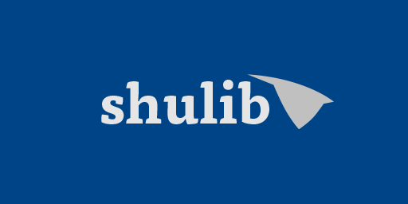

    
    

**Seton Hall University Library for VEX Robotics**

## Table of Contents
- [Introduction](#introduction)
- [Features](#features)
- [To-Do](#to-do)
- [License](#license)

## Introduction
shulib is a PROS template heavily inspired by lemlib, designed to make implementing new developments simple and seamless.

## Features
### Current Features (In Development but Usable)
- **Chassis Constructors**
  - Easily build and customize your robot's chassis with predefined templates and flexible parameters.
  - Supports various configurations to accommodate different robot designs.

- **Odometry/Absolute Positioning System**
  - Accurate tracking of the robot's position on the field.
  - Integration with sensors for real-time data processing.
  - Provides essential data for autonomous navigation and movement precision.

### Planned Features
- **Communication Protocols**
  - Enhanced communication between multiple robots.
  - Integration with other libraries and frameworks.

- **User Interface Tools**
  - Tools for developing intuitive user interfaces.
  - Dashboard integrations for monitoring and control.

## To-Do
### Upcoming Features
- [ ] **Communication Protocols**
- [ ] **Comprehensive Documentation**

### Ongoing Improvements
- [ ] **Odometry**

### Bug Fixes
- [ ] ...

## License
shulib is released under the [MIT License](LICENSE).

---
